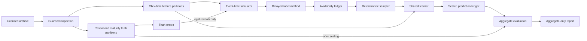

# Architecture

LateSignal is an offline event-time research system for delayed conversion learning.
Its central design constraint is that prediction-time features and eventual truth follow separate storage and access paths until truth becomes legally available in simulated time.

## System boundaries

The licensed archive and every row-level derivative live under ignored local roots.
The repository may contain source code, authored configurations, tests, and reviewed aggregate results only.

## Acquisition and preparation

`latesignal data fetch` is the only normal command that accesses the dataset URL.
It records an explicit license acknowledgement, streams the response to a temporary file, verifies the byte count, inspects every tar member, and promotes the archive to a content-addressed path.
When the authored configuration has no authoritative digest, the first complete archive remains a candidate until the observed SHA-256 is explicitly reviewed.

`latesignal data inspect` validates the outer archive contract, extracts only the configured data member through a bounded stream, audits field counts and label-delay combinations, infers the timestamp scale uniquely, and reconciles accepted and quarantined rows.
Inspection rejects unsafe paths, duplicate members, links, devices, excessive member counts, excessive expansion, and unexpected members before promotion.

`latesignal data prepare` writes physically separate feature and truth stores.
Feature partitions contain only click-time columns, deterministic categorical hashes, burn-in-fitted numeric transforms, and past-only history features.
Truth partitions contain final labels and legal availability times, organized by positive reveal day or negative maturity day.
Every prepared Parquet file is recorded by relative path, byte count, and SHA-256 digest.

## Event-time execution

At every boundary, prediction precedes truth delivery at the same time.
The engine performs these operations in order:

1. Predict newly visible clicks using the current model.
2. Persist predictions atomically.
3. Deliver clicks to the delayed-label method.
4. Deliver only positive reveals and negative maturities whose availability time has arrived.
5. Append emitted observations to the availability ledger.
6. Update mature monitoring evidence from reserved examples.
7. Ask the scheduler whether to spend the current credit.
8. Sample only legal non-monitoring observations and train for the exact configured steps.
9. Persist checkpoint state and ledgers.

Runtime assertions reject any training observation with `available_at` later than simulator time.
Monitoring membership is deterministic and is supplied to the sampler as an exclusion set.
The final prediction period is sealed before eventual truth is joined for evaluation.

## Shared learner and methods

The online conversion learner uses 17 field-specific embeddings, four transformed numeric inputs, three hidden layers, and a binary logit.
Matched studies share initialization, model architecture, optimizer family, batch size, sampler, seeds, schedules where applicable, and core optimizer-example budgets.

Study A changes only the delayed-label strategy.
Its implementations cover complete wait, immediate fake negative, fixed wait, DFM, FNW, the ES-DFM constant-wait transfer, and an explicitly unattainable oracle reference.
Method-specific auxiliary work remains outside the matched core budget and is reported separately.

Study B changes only the timing of a fixed number of update credits.
It compares early, midpoint, deadline, and mature-calibration-triggered policies over the same five-day allocation windows.

## Evaluation and publication

Final evaluation accepts only sealed predictions for click days 65 through 89.
The evaluation layer computes log loss, PR-AUC, Brier score, ROC-AUC, calibration coefficients, fixed-bin ECE, reliability tables, required slices, intermediate-budget quality, and compute Pareto status.
Paired comparisons require identical click IDs, click days, final labels, and seeds across methods.
The primary uncertainty calculation uses three-day contiguous blocks with one-day and seven-day sensitivity analyses.

The report path accepts a strict aggregate-only schema.
Unknown row-level fields are rejected.
The renderer produces static HTML, JSON, or text plus flat CSV tables and a content-hashed output manifest.

## Identity chain

The pre-scoring protocol lock binds these identities before final evaluation:

- Authored protocol and final configuration.
- Exhaustive selection-period evidence and deterministic tie decisions.
- Passing feasibility evidence and selected steps per credit.
- Every prepared-data file digest.
- Git commit and dirty-tree status.
- `uv.lock`, installed dependency versions, Python compiler, operating system, CUDA runtime, driver, and GPU identity.
- Final seeds and exact run matrix.

The lock has its own canonical SHA-256 digest.
A dirty-tree override is recorded and makes the lock ineligible for publication.
